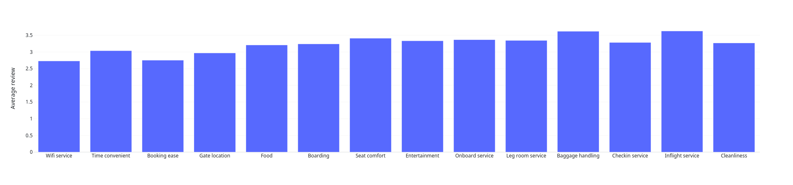

# Airline satisfaction

## Projekt na QHackaton.

Aplikacja używająca Pandas i Dash do wizualizacji danych z ankiet linii lotniczej.

### Średnia ocen

### Wygoda siedzenia a odległość podróży

### Porównanie ocen usatysfakcjonowanych klientów i nieusatysfakcjonowanych

### Korelacja między poszczególnymi ocenami o ogólną satysfakcją
